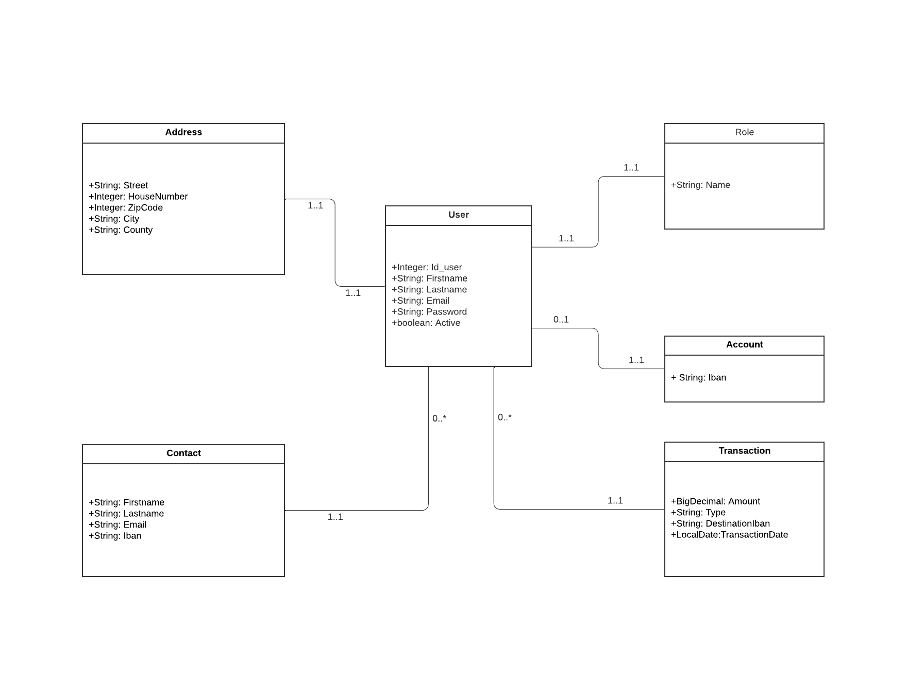
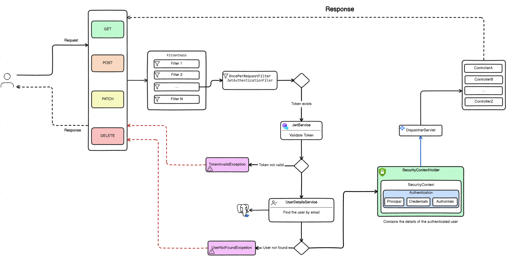

# Banking Project

## Table of Contents

- [Overview](#overview)
- [Features](#features)
- [Technologies Used](#technologies-used)
    - [Backend (Banking)](#backend-Banking)
    - [Frontend (Banking-ui)](#frontend-Banking-ui)
- [Learning Objectives](#learning-objectives)
- [License](#license)
- [Getting Started](#getting-started)
- [Contributors](#contributors)
- [Acknowledgments](#acknowledgments)

## Overview

The Banking application is a comprehensive, full-stack solution that allows users to manage their accounts, track collections, and conduct transactions with others through contact-based account interactions. It offers key features such as user registration, secure email verification, account management (including creation, updating, sharing, and archiving), detailed statistics, and a full transaction history. The application prioritizes security through the use of JWT tokens and follows industry best practices in REST API design. The backend is built with Spring Boot 3 and Spring Security 6, while the frontend is developed using Angular, with Bootstrap for styling.

## Features

-    User Registration: Users can create a new account.
-    Email Validation: Accounts are activated through secure email validation codes.
-    User Authentication: Existing users can securely log in to their accounts.
-    Account Management: Users can create and update contacts, as well as view transaction history and deposits.
-    Transaction Processing: Users can perform transactions with their contacts.
-    Deposit Approval: Functionality to verify and approve deposits.

#### Class diagram

#### Spring security diagram

#### Backend pipeline

#### Backend pipeline

## Technologies Used

### Backend (Banking)

- Spring Boot 3
- Spring Security 6
- JWT Token Authentication
- Spring Data JPA
- JSR-303 and Spring Validation
- OpenAPI and Swagger UI Documentation
- Docker
- GitHub Actions
- Keycloak

### Frontend (Banking-ui)

- Angular 16
- Component-Based Architecture
- Lazy Loading
- Authentication Guard
- OpenAPI Generator for Angular
- Bootstrap

## Learning Objectives

By following this project, students will learn:

- Designing a class diagram from business requirements
- Implementing a mono repo approach
- Securing an application using JWT tokens with Spring Security
- Registering users and validating accounts via email
- Utilizing inheritance with Spring Data JPA
- Implementing the service layer and handling application exceptions
- Object validation using JSR-303 and Spring Validation
- Handling custom exceptions
- Implementing pagination and REST API best practices
- Using Spring Profiles for environment-specific configurations
- Documenting APIs using OpenAPI and Swagger UI
- Implementing business requirements and handling business exceptions
- Dockerizing the infrastructure
- CI/CD pipeline & deployment

## License

This project is licensed under the Apache License 2.0. See the [LICENSE](LICENSE) file for details.

## Getting Started

To get started with the Book Social Network project, follow the setup instructions in the respective directories:

- [Backend Setup Instructions](https://github.com/oussama123-ai/SpringBoot-Lab/blob/main/README.md)
- [Frontend Setup Instructions](banking-ui/README.md)

## Contributors

- [Oussama Othmani](https://github.com/oussama123-ai)

## Acknowledgments

Special thanks to the developers and maintainers of the technologies used in this project. Their hard work and dedication make projects like this possible.
